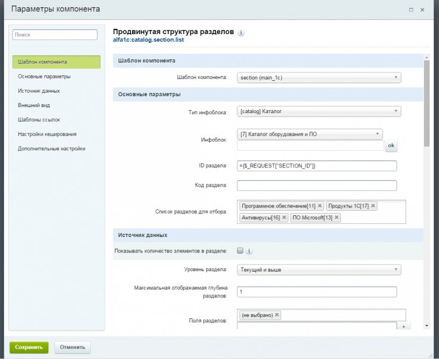
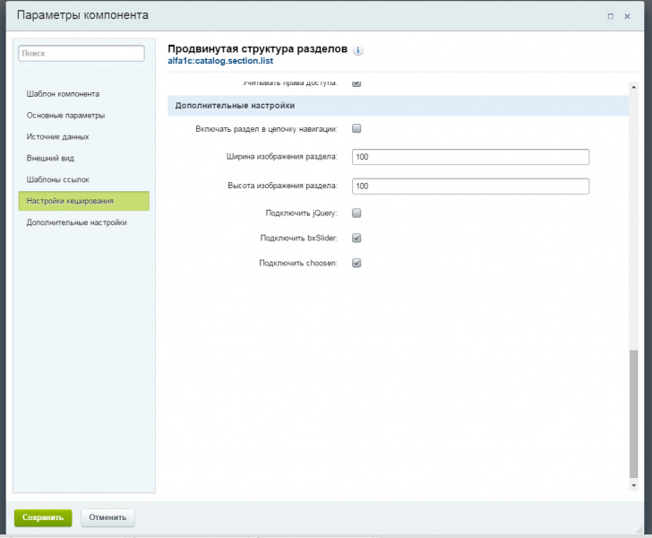
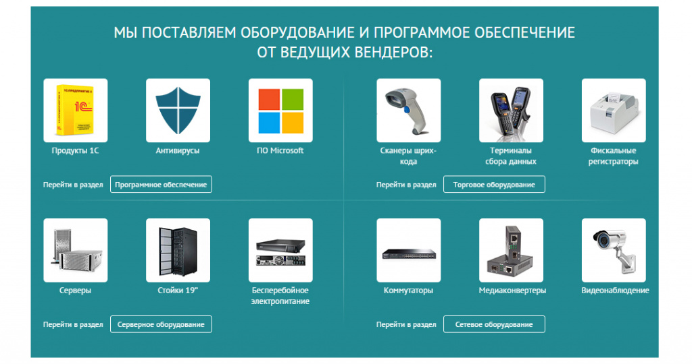

# Продвинутая структура разделов
 

https://marketplace.1c-bitrix.ru/solutions/alfa1c.adsectlist/ 

**Описание**

Модуль содержит компонент, для показа разделов инфоблока.
Компонент умеет:
Показывать разделы определенного уровня.
Показывать разделы до определенного уровня.
Показывать разделы с определенного уровня.
Показывать разделы с заданным свойством.
Показывать разделы, выбранные в настройках компонента.
Показывать разделы в виде дерева, слайдера, блоком.

Уважаемые пользователи, компонент имеет в своем составе слайдер и [кастомизатор](http://harvesthq.github.io/chosen/) полей типа input.
Во избежание конфликтов, вы всегда можете отключить их в настройке компонента. Так уже, учитывайте этот момент, при размещении нескольких компонентов на одной странице, подключать скрипты необходимо, только в одном из них.

