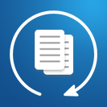
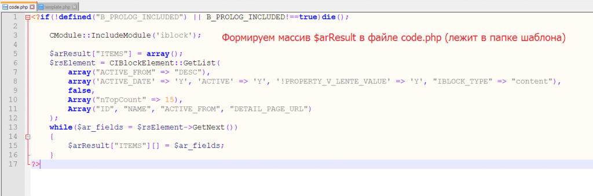
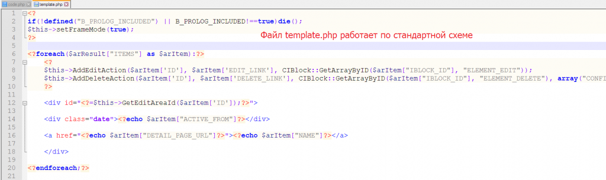

# Простой кеширующий компонент
 

https://marketplace.1c-bitrix.ru/solutions/tega.simplecache/ 

**Описание**

Данный модуль добавляет на сайт компонент для кеширования произвольного кода разработчика. 
Используйте, если нужно закешировать код, не оформляя его в полноценный компонент и не используя классы CPageCache и CPHPCache. 
Компонент нарушает принципы MVC Битрикса, код формирующий $arResult находится в специальном файле шаблона (code.php), а не в component.php.

Инструкция:
1) Добавить компонент на страницу
2) Создать свой шаблон, скопировав шаблона ".default"
3) Разместить формирующий $arResult код в файле code.php шаблона
4) Использовать template.php шаблона по стандартной схеме

