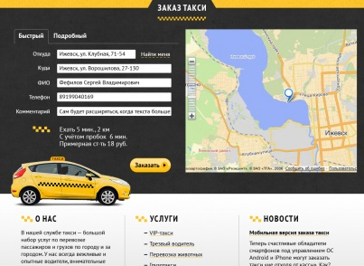
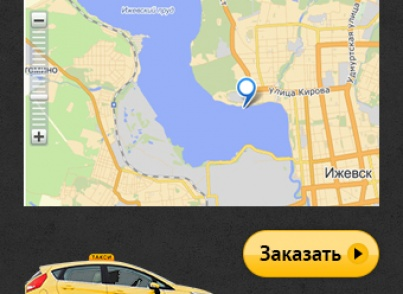
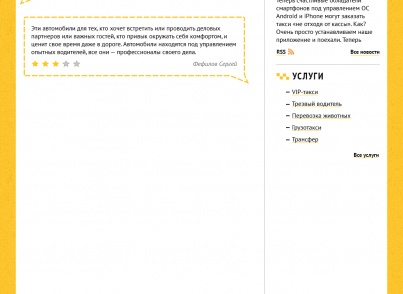
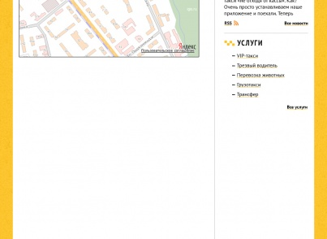

# Адаптивный сайт службы такси

http://demo.taxi3c.ru/

**Описание решения**

Предлагаем вашему вниманию адаптивный сайт службы такси (приспосабливается к размеру экрана пользователя)!

В состав готового решения входят:
- Полностью готовый и наполненный информацией сайт
- Несколько готовых адаптивных шаблонов на выбор
- Удобная онлайн-форма заказа такси
- Построение маршрута по карте Яндекс или Гугл
- Примерный расчет стоимости поездки
- Точный расчет стоимости поездки (загрузка данных из вашей программы)
- Интеграция сайта с программами «Такси Мастер», «ТелеМаксима», РосТакси, Sedi, О-Такси, Мадив, Оптеум, РБТ, Лайм
- Возможность отправить резюме на вакансию с сайта
- Удобно настроенный функционал сайта на базе популярной системы управления сайтом 1С-Битрикс редакции «Старт»
- Разработанная документация

Внимание! Мы выпустили улучшение для готового сайта службы такси - управление городами. Вы можете создавать не ограниченное кол-во городов, задавать для них индивидуальные тарифы, контакты, услуги, новости и т.д.
Оно еще не готово в виде установщика.
Стоимость и условия приобретения уточняйте по тел 8 (3412) 676-555 или taxi@3colors.ru

Внимание! Если у вас уже есть программа автоматизация службы такси и она имеет некоторую популярность, то мы готовы сделать связь с вашей программой бесплатно.

Если у вас ещё нет редакции 1С-Битрикс "Старт", обращайтесь, мы её купим для вас, развернем на хостинге и настроим решение.

Все инфоблоки удобно настроены, легко администрировать.
Сайт подготовлен к дальнейшему продвижению в поисковых системах.

Возможна дополнительная помощь в наполнение/изменении, а также доработке сайта (отдельная смета).

Планы по развитию:
- Личный кабинет клиента с историей заказов (загрузка данных из вашей программы)
- Увеличение кол-ва шаблонов и цветовых схем
- Внедрение связи сайта с другими программами по автоматизации служб такси
- Оплата электронными деньгами и пластиковыми картами

Часть улучшений и дополнений будет бесплатными, а часть - платными.

Все бесплатные улучшения и доработки будут предлагаться и устанавливаться клиентам в автоматическом режиме.

Подробнее -- http://taxi3c.ru

Руководство пользователя:
https://docs.google.com/document/d/1siH03OopzYhB0-YbnBydw9BCxzHXy8cuZgRaLiXKDhI/edit

