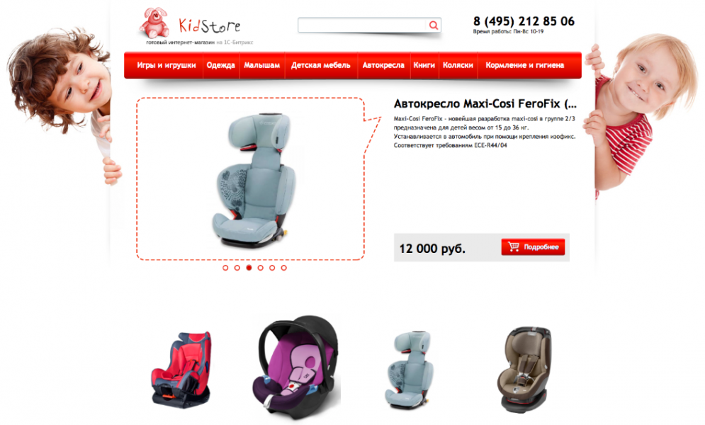
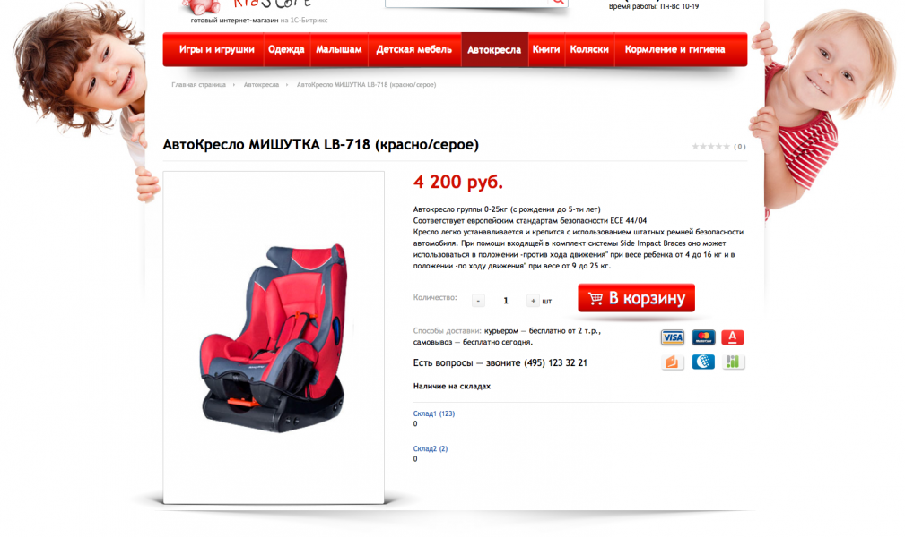

# KidStore готовый интернет-магазин детской одежды

**Описание решения**  
KidStore: готовый интернет-магазин детской одежды, товаров и игрушек на 1С-Битрикс — включает все возможности редакции Бизнес: учет остатков по складам, торговые предложения, наборы и комплекты. Дизайн решения наследует верстку демо-магазина «из коробки» от 1С-Битрикс, а значит обновления функционала платформы в будущем будут совместимы с этим решением. Магазин адаптирован под мобильные устройства.

Добавьте товары, поменяйте контактную информацию и вы получите готовый интернет магазин детских товаров всего за несколько часов.

Пример заполненного товара:
http://child.remarkdigital.ru/catalog...es+BMW+X6/

    Изменяется картинка товара при выборе другого цвета (торгового предложения)
    Сформирован набор
    Есть возможность составить свой набор
    Настроены скидки  

