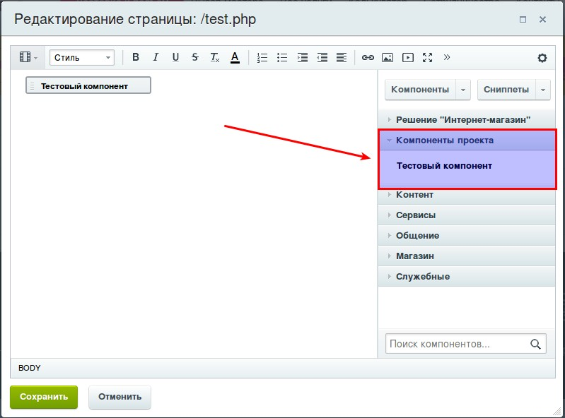
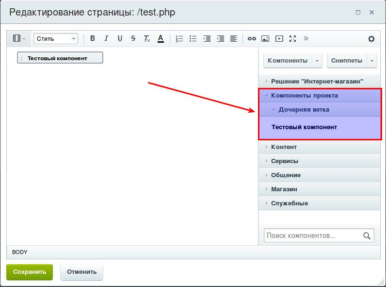

# Статьи 1С Битрикс | Пример создания компонента

**Шаблон простого компонента на D7**

В этой статье предпринята попытка пошагово описать процесс создания простого компонента для 1С Битрикс 
с минимальным использованием функционала старого ядра и максимально близко к принципам написания кода на D7.

Репозиторий примера можно посмотреть [тут](https://github.com/gdecider/bx-comp-startTmpl)

## Размещение компонента в файловой структуре сайта

Компоненты в битрикс размещаются по пути от корня вашего сайта ```/bitrix/components```
В этой папке всегда есть каталог ```bitrix``` нем расположены компоненты, которые достались вам при установки Битрикса
и количество этих компонентов варьируется в зависимости от используемой вами редакцией продукта.

В папке ```/bitrix/components``` можно создавать свои папки, в терминах битрикса это называется **"пространством имен"**,
так например при установке модулей из Маркетплейс модули партнеров скопируют свои компоненты именно в эту папку, 
предварительно создав в ней свое "пространство имен".

Не путайте термин "пространства имен" в рамках Битрикса и [пространства имен PHP](http://php.net/manual/ru/language.namespaces.php) 
этот термин остался в Битриксе исторически и нам придется с этим мириться.

Так же компоненты можно разместить в каталоге ```/local/components``` в этой папке нужно так же создать свое "пространство имен" в 
виде отдельного каталога в котором и разместить свой компонент.

**Для размежения локальных компонентов, которые пишутся под конкретный проект, а так же для кастомизации стандартных компонентов 
Битрикса нужно использовать именно папку ```/local/components```**

Для нашего примера будем использовать папку 'example' в качестве "пространства имен", а назовем компонент ```compsimple```
таким образом итоговый путь к файлам разрабатываемого компонента будет таким: ```/local/components/example/compsimple```.

## Структура файлов и папок компонента

Основной файл компонента к которому происходит обращение при подключении компонента на странице и в котором находится точка входа в логику работы компонента ```class.php```. 

Следующий по важности файл ```.description.php``` он содержит описание компонента и путь для его отображения в интерфейсе системы.

Принято выносить языкозависимые тексты в [языковые файлы](https://dev.1c-bitrix.ru/learning/course/index.php?COURSE_ID=43&LESSON_ID=3695&LESSON_PATH=3913.4776.3695) поэтому нам нужна папка ```lang``` в которой будут находиться папки с кодами языков, в нашем случае только ```ru``` в ней должен быть еще один файл ```.description.php```, а он уже содержит массив с переводами текстов.

Почти каждый компонент в итоге своей работы выводит информацию на сайт, для этого нужно создать файлы шаблонов компонента. Папка ```templates``` создается для хранения шаблонов отображения, шаблон по умолчанию должен располагаться в папке ```.default``` в файле ```template.php```.

Выше был описан минимальный набор файлов, обеспечивающий работу компонента. Если компоненту для своей работы требуются дополнительные файлы или логика компонента требует создания нескольких классов, то никто не запрещает добавлять все нужные данные в папку компонента и подключать их в нужных местах кода.

Большей части компонентов для обеспечения корректной работы требуется передать какие-либо начальные значения, обеспечить отображение полей для ввода параметров позволит файл ```.parameters.php```

Итоговая структура файлов и папок используемых в примере выглядит так:

```
/local/components/example/compsimple #component root directory
├── /lang
|   └── /ru
|       └── .description.php
├── /templates
|   └── /.default
|       └── template.php
├── .description.php
├── .parameters.php
└── class.php
```

### class.php

В файле class.php должен располагаться класс компонента унаследованный от ```CBitrixComponent```.

Принцыпы именования класса компонента нигде не регламинтированы, но рекомендуется давать имя классу максимально похожее на путь к компоненту. Наш класс будет называться ```ExampleCompSimple```.

[пример из официальной документации](https://dev.1c-bitrix.ru/learning/course/index.php?COURSE_ID=43&LESSON_ID=2028&LESSON_PATH=3913.4565.2028)

Пример содержимого нашего файла:

```php
<?php
use \Bitrix\Main\Loader;
use \Bitrix\Main\Application;

if (!defined('B_PROLOG_INCLUDED') || B_PROLOG_INCLUDED !== true) die();

class ExampleCompSimple extends CBitrixComponent {
    private $_request;

    /**
     * Проверка наличия модулей требуемых для работы компонента
     * @return bool
     * @throws Exception
     */
    private function _checkModules() {
        if (   !Loader::includeModule('iblock')
            || !Loader::includeModule('sale')
        ) {
            throw new \Exception('Не загружены модули необходимые для работы модуля');
        }

        return true;
    }

    /**
     * Обертка над глобальной переменной
     * @return CAllMain|CMain
     */
    private function _app() {
        global $APPLICATION;
        return $APPLICATION;
    }

    /**
     * Обертка над глобальной переменной
     * @return CAllUser|CUser
     */
    private function _user() {
        global $USER;
        return $USER;
    }

    /**
     * Подготовка параметров компонента
     * @param $arParams
     * @return mixed
     */
    public function onPrepareComponentParams($arParams) {
        // тут пишем логику обработки параметров, дополнение параметрами по умолчанию
        // и прочие нужные вещи
        return $arParams;
    }

    /**
     * Точка входа в компонент
     * Должна содержать только последовательность вызовов вспомогательых ф-ий и минимум логики
     * всю логику стараемся разносить по классам и методам 
     */
    public function executeComponent() {
        $this->_checkModules();

        $this->_request = Application::getInstance()->getContext()->getRequest();
        
        // что-то делаем и результаты работы помещаем в arResult, для передачи в шаблон
        $this->arResult['SOME_VAR'] = 'some result data for template';

        $this->includeComponentTemplate();
    }
}
```

### .description.php

В принципах описания компонента ничего не меняется почи с времен появления БУС. [Тут](https://dev.1c-bitrix.ru/community/blogs/components2/133.php) относительно подробное описание структуры файла.

Рассмотрим пару примеров размещения компонента в визуальном редакторе:

* Разместить компонент в ветке на ровне с остальными основными ветками

```php
<?if (!defined("B_PROLOG_INCLUDED") || B_PROLOG_INCLUDED!==true) die();

use Bitrix\Main\Localization\Loc;

$arComponentDescription = [
    "NAME" => Loc::getMessage("EXAMPLE_COMPSIMPLE_COMPONENT"),
    "DESCRIPTION" => Loc::getMessage("EXAMPLE_COMPSIMPLE_COMPONENT_DESCRIPTION"),
    "COMPLEX" => "N",
    "PATH" => [
        "ID" => Loc::getMessage("EXAMPLE_COMPSIMPLE_COMPONENT_PATH_ID"),
        "NAME" => Loc::getMessage("EXAMPLE_COMPSIMPLE_COMPONENT_PATH_NAME"),
    ],
];
?>
```

**Результат:**



* Разместить компонент в дочернюю ветку

```php
<?if (!defined("B_PROLOG_INCLUDED") || B_PROLOG_INCLUDED!==true) die();

use Bitrix\Main\Localization\Loc;

$arComponentDescription = [
    "NAME" => Loc::getMessage("EXAMPLE_COMPSIMPLE_COMPONENT"),
    "DESCRIPTION" => Loc::getMessage("EXAMPLE_COMPSIMPLE_COMPONENT_DESCRIPTION"),
    "COMPLEX" => "N",
    "PATH" => [
        "ID" => Loc::getMessage("EXAMPLE_COMPSIMPLE_COMPONENT_PATH_ID"),
        "NAME" => Loc::getMessage("EXAMPLE_COMPSIMPLE_COMPONENT_PATH_NAME"),
        "CHILD" => [
            "ID" => Loc::getMessage("EXAMPLE_COMPSIMPLE_COMPONENT_CHILD_PATH_ID"),
            "NAME" => GetMessage("EXAMPLE_COMPSIMPLE")
        ]
    ],
];
?>
```

**Результат:**



Пример файла языковых констант ```lang/ru/.description.php```:

```php
<?if (!defined("B_PROLOG_INCLUDED") || B_PROLOG_INCLUDED!==true) die();

$MESS["EXAMPLE_COMPSIMPLE_COMPONENT_PATH_ID"] = "local";
$MESS["EXAMPLE_COMPSIMPLE_COMPONENT_CHILD_PATH_ID"] = "compsimplechiltpath";
$MESS["EXAMPLE_COMPSIMPLE_COMPONENT_PATH_NAME"] = "Компоненты проекта";
$MESS["EXAMPLE_COMPSIMPLE"] = "Дочерняя ветка";
$MESS["EXAMPLE_COMPSIMPLE_COMPONENT"] = "Тестовый компонент";
$MESS["EXAMPLE_COMPSIMPLE_COMPONENT_DESCRIPTION"] = "Описание тестового компонента";
```

### .parameters.php

Для отображения полей для передачи параметров в форме настроек компонента предназначен файл .parameters.php. Он содержит в себе массив с определением типа и значений входных параметров компонента.

[Официальная документация](https://dev.1c-bitrix.ru/learning/course/index.php?COURSE_ID=43&LESSON_ID=2132)

Пример файла:

```php
<?if (!defined("B_PROLOG_INCLUDED") || B_PROLOG_INCLUDED!==true) die();

/**
 * @var string $componentPath
 * @var string $componentName
 * @var array $arCurrentValues
 * */
 
use Bitrix\Main\Loader;
use Bitrix\Main\Localization\Loc;

if( !Loader::includeModule("iblock") ) {
    throw new \Exception('Не загружены модули необходимые для работы компонента');
}

// типы инфоблоков
$arIBlockType = CIBlockParameters::GetIBlockTypes();

// инфоблоки выбранного типа
$arIBlock = [];
$iblockFilter = !empty($arCurrentValues['IBLOCK_TYPE'])
    ? ['TYPE' => $arCurrentValues['IBLOCK_TYPE'], 'ACTIVE' => 'Y']
    : ['ACTIVE' => 'Y'];

$rsIBlock = CIBlock::GetList(['SORT' => 'ASC'], $iblockFilter);
while ($arr = $rsIBlock->Fetch()) {
    $arIBlock[$arr['ID']] = '['.$arr['ID'].'] '.$arr['NAME'];
}
unset($arr, $rsIBlock, $iblockFilter);

$arComponentParameters = [
    // группы в левой части окна
    "GROUPS" => [
        "SETTINGS" => [
            "NAME" => Loc::getMessage('EXAMPLE_COMPSIMPLE_PROP_SETTINGS'),
            "SORT" => 550,
        ],
    ],
    // поля для ввода параметров в правой части
    "PARAMETERS" => [
        // Произвольный параметр типа СПИСОК
        "IBLOCK_TYPE" => [
            "PARENT" => "SETTINGS",
            "NAME" => Loc::getMessage('EXAMPLE_COMPSIMPLE_PROP_IBLOCK_TYPE'),
            "TYPE" => "LIST",
            "ADDITIONAL_VALUES" => "Y",
            "VALUES" => $arIBlockType,
            "REFRESH" => "Y"
        ],
        "IBLOCK_ID" => [
            "PARENT" => "SETTINGS",
            "NAME" => Loc::getMessage('EXAMPLE_COMPSIMPLE_PROP_IBLOCK_ID'),
            "TYPE" => "LIST",
            "ADDITIONAL_VALUES" => "Y",
            "VALUES" => $arIBlock,
            "REFRESH" => "Y"
        ],
        // Произвольный параметр типа СТРОКА
        "SECTION_IDS" => [
            "PARENT" => "SETTINGS",
            "NAME" => Loc::getMessage('EXAMPLE_COMPSIMPLE_PROP_SECTION_IDS'),
            "TYPE" => "STRING",
            "MULTIPLE" => "N",
            "DEFAULT" => "",
            "COLS" => 25
        ],
        // Настройки кэширования
        'CACHE_TIME' => ['DEFAULT' => 3600],
    ]
];
```

Языковой файл ```lang/ru/.parameters.php```

```php
<?if (!defined("B_PROLOG_INCLUDED") || B_PROLOG_INCLUDED!==true) die();

$MESS["EXAMPLE_COMPSIMPLE_PROP_SETTINGS"] = "Выбор инфоблока и разделов";
$MESS["EXAMPLE_COMPSIMPLE_PROP_IBLOCK_TYPE"] = "Тип инфоблока";
$MESS["EXAMPLE_COMPSIMPLE_PROP_IBLOCK_ID"] = "Инфоблок";
$MESS["EXAMPLE_COMPSIMPLE_PROP_SECTION_IDS"] = "ID разделов через запятую";
```

### Шаблон компонента

Компонент может содержать множество шаблонов. Шаблон по умолчанию находится в папке .default и именно он отрабатывает, если приподключении компонента оставить имя шаблона пустым.

В нашем примере просто выведем дамп массива входных параметров и массива результатов работы компонента.

```php
<?php if(!defined("B_PROLOG_INCLUDED") || B_PROLOG_INCLUDED!==true)die();?>

<?
    \Bitrix\Main\Diag\Debug::dump($arParams);
    \Bitrix\Main\Diag\Debug::dump($arResult);
?>
```
