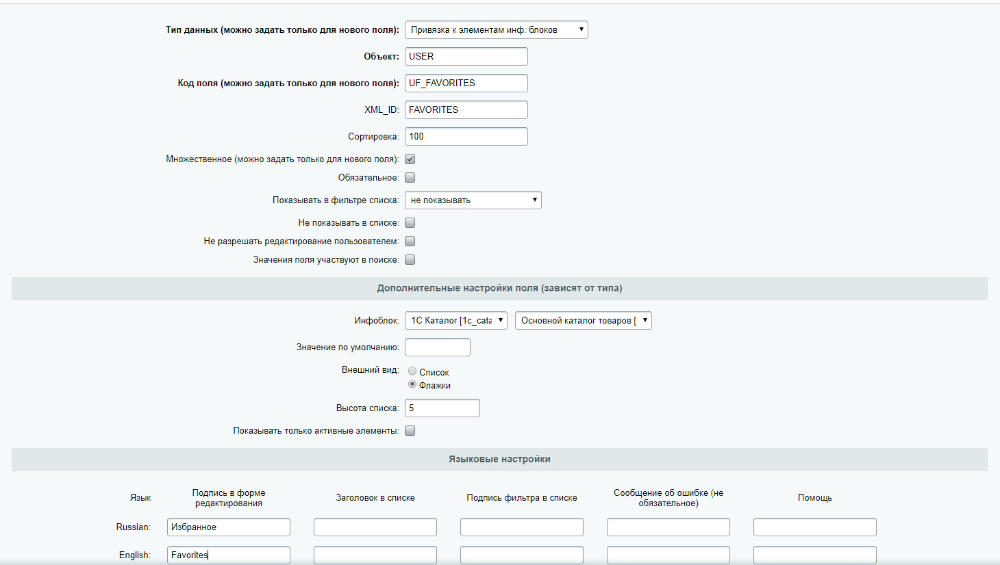

# Bitrix_Favorites
[Bitrix] Добавление товаров в избранное

Нужно реализовать функционал избранного. 

1. Для незарегистрированного пользователя мы будем записывать ID товаров в Cookies, а вот для зарегистрированного пользователя в пользовательское поле, которое мы создадим.
   Данное поле должно обязательно иметь множественное значение. Пример представлен ниже:



2. После того как мы завели пользовательское поле **UF_FAVORITES**, требуется создать страницу и ссылку (например "/personal/wishlist") на избранное . В данном примере выводится количество добавленных товаров в избранное:
```php
<?
use Bitrix\Main\Application;
use Bitrix\Main\Web\Cookie;
$application = Application::getInstance();
$context = $application->getContext(); 
 /* Вывод количества избранного */
    if(!$USER->IsAuthorized()) // Для неавторизованного
    {
        $arElements = unserialize($APPLICATION->get_cookie('favorites'));
        if($arElements == '')
		unset($arElements);

	foreach($arElements as $k=>$fav) // Checking empty IDs
	{
		if($fav == '0')
			 unset($arElements[$k]);
			unset($fav);
	}
        $wishCount = count($arElements);
    }
    else {
         $idUser = $USER->GetID();
         $rsUser = CUser::GetByID($idUser);
         $arUser = $rsUser->Fetch();
        foreach($arUser['UF_FAVORITES'] as $k=>$fav) // Checking empty IDs
	{
		if($fav == '0') 
		{
			unset($arUser['UF_FAVORITES'][$k]);
			unset($fav);
		}
	}
        $wishCount = count($arUser['UF_FAVORITES']);


     }

 /* Вывод количества избранного */
?>
<a id='want' class="block" href="/personal/wishlist/">
    <span class="col"><?=$wishCount?></span>
    <div class="icon"></div>
    <p>Хочу</p>
</a>
```
Файл favoriteButton.php


3. Теперь нужно подготовить AJAX функцию, которая будет отправлять запрос с нужным нам ID товара, и добавлять его в избранное. Функция проверяет, есть ли товар в избранном или нет, если есть, то мы даём понять, что нам нужно удалить товар из избранного. Если операция прошла успешно, пересчитываем количество товаров в избранном и выводим нужое нам число.

Теперь нужно подготовить функцию с AJAX-запросом, с помощью которой будет отправляться ID товара в обработчик, в котором будет происходить его  добавление в избранное. Функция проверяет, наличие товара в массиве, если он уже добавлен, то мы его удаляем. Если операция прошла успешно, пересчитываем количество товаров в избранном и выводим количество. Пример:

```javascript
$(document).ready(function() {
    /* Favorites */
    $('.favor').on('click', function(e) {
        var favorID = $(this).attr('data-item');
        if($(this).hasClass('active'))
            var doAction = 'delete';
        else
            var doAction = 'add';

        addFavorite(favorID, doAction);
    });
    /* Favorites */
});
/* Избранное */
    function addFavorite(id, action)
    {
        var param = 'id='+id+"&action="+action;
        $.ajax({
            url:     '/local/ajax/favorites.php', // URL отправки запроса
            type:     "GET",
            dataType: "html",
            data: param,
            success: function(response) { // Если Данные отправлены успешно
                var result = $.parseJSON(response);
                if(result == 1){ // Если всё чётко, то выполняем действия, которые показывают, что данные отправлены :)
                     $('.favor[data-item="'+id+'"]').addClass('active');
                     var wishCount = parseInt($('#want .col').html()) + 1;
                     $('#want .col').html(wishCount); // Визуально меняем количество у иконки
                }
                if(result == 2){
                     $('.favor[data-item="'+id+'"]').removeClass('active');
                     var wishCount = parseInt($('#want .col').html()) - 1;
                     $('#want .col').html(wishCount); // Визуально меняем количество у иконки
                }
            },
            error: function(jqXHR, textStatus, errorThrown){ // Если ошибка, то выкладываем печаль в консоль
                console.log('Error: '+ errorThrown);
            }
         });
    }
/* Избранное */
```

Файл script.js

4. При помощи AJAX-запроса мы обращаемся к обработчику favorites.php, в котором идёт проверка пользователя, авторизован ли он. Делаем запись в пользовательское поле UF_FAVORITES, если он авторизован.
   Если пользователь не авторизован, записываем ID товара в Cookies. Чтобы корректно сделать запись, нужно вернуть из cookies массив с избранными товарами, и добавить нашу позицию в массив. Также присутствует проверка на дублирование, для исключения повторений.
   
   Код обработчика favorites.php , который добавляет\удаляет товары избранного:
   
```php
<?require($_SERVER["DOCUMENT_ROOT"]."/bitrix/header.php");
$APPLICATION->SetTitle("Title");
$GLOBALS['APPLICATION']->RestartBuffer();
/* Избранное */
   global $APPLICATION;
   if($_GET['id'])
   {
      if(!$USER->IsAuthorized()) // Для неавторизованного
      {
        $arElements = unserialize($APPLICATION->get_cookie('favorites'));
        if(!in_array($_GET['id'], $arElements))
        {
               $arElements[] = $_GET['id'];
               $result = 1; // Датчик. Добавляем
        }
        else {
            $key = array_search($_GET['id'], $arElements); // Находим элемент, который нужно удалить из избранного
            unset($arElements[$key]);
            $result = 2; // Датчик. Удаляем
        }
        $APPLICATION->set_cookie("favorites", serialize($arElements));
      }
      else { // Для авторизованного
         $idUser = $USER->GetID();
         $rsUser = CUser::GetByID($idUser);
         $arUser = $rsUser->Fetch();
         $arElements = $arUser['UF_FAVORITES'];  // Достаём избранное пользователя
         if(!in_array($_GET['id'], $arElements)) // Если еще нету этой позиции в избранном
         {
            $arElements[] = $_GET['id'];
            $result = 1;
         }
         else {
            $key = array_search($_GET['id'], $arElements); // Находим элемент, который нужно удалить из избранного
            unset($arElements[$key]);
            $result = 2;
         }
         $USER->Update($idUser, Array("UF_FAVORITES"=>$arElements )); // Добавляем элемент в избранное
      }
   }
/* Избранное */
echo json_encode($result);
 die(); ?>
<?require($_SERVER["DOCUMENT_ROOT"]."/bitrix/footer.php");?>
```

5. Мы сформировали обработчик, который добавляет товары в избранное. После этого попробуем добавить парочку товаров в избранное. Они запишутся в Cookies или в пользовательское поле UF_FAVORITES (в зависимости от типа пользователя). Если мы выведем массив '$_COOKIE', то должны обнаружить там добавленные ID товара.
Чтобы проверить ID товаров в поле UF_FAVORITES, используем код:
```php
<?
global $APPLICATION;
    $idUser = $USER->GetID();
    $rsUser = CUser::GetByID($idUser);
    $arUser = $rsUser->Fetch();
    $arFavorites = $arUser['UF_FAVORITES'];  // Достаём избранное пользователя
    print_r($arFavorites);
?>
```
Осталось нужным нам образом представить эти товары пользователю. В своём примере я использовал **bitrix:catalog.section**, хотя рекомендую использовать **bitrix:catalog.top**.


Перед вызовом компонента формируем фильтр с соответствующим условием. Если авторизованы, возвращаем пользовательское поле UF_FAVORITES. И записываем массив $favorites в переменную arrFilter, для фильтрации вывода товаров избранного.
Код перед вызовом компонента:

```php
<?
if(!$USER->IsAuthorized()) // Для неавторизованного
{
    global $APPLICATION;
    
    $favorites = unserialize($APPLICATION->get_cookie('favorites'));
    if (empty($favorites)) {
        $favorites = array(0);
    } else {
        $favorites = unserialize($APPLICATION->get_cookie('favorites'));
    }
}
else {
    $idUser = $USER->GetID();
    $rsUser = CUser::GetByID($idUser);
    $arUser = $rsUser->Fetch();
    $favorites = $arUser['UF_FAVORITES'];
    //print_r($favorites);
}

$GLOBALS['arrFilter']=Array("ID" => $favorites);
?>
```
или

```php
<? 
if(!$USER->IsAuthorized()) // Для неавторизованного
{
    global $APPLICATION;
	$favorites = unserialize(\Bitrix\Main\Application::getInstance()->getContext()->getRequest()->getCookie("favorites"));
}
else {
     $idUser = $USER->GetID();
     $rsUser = CUser::GetByID($idUser);
     $arUser = $rsUser->Fetch();
     $favorites = $arUser['UF_FAVORITES'];
    
}

$GLOBALS['arrFilter']=Array("ID" => $favorites);
if(count($favorites) > 0 && is_array($favorites)): ?>
```
Товары выводятся, добавляются в избранное и удаляются. Осталось показать пользователю, что товар успешно добавился в избранное, и при перемещению по каталогу, он видел, какие товары добавлены в наш 'wishlist'. Я сделал закрашивание иконки (сердца), давая понять, что товар избранный.
Для этого обратимся к файлу **component_epilog.php** в нашем компоненте (в данном случае **bitrix:catalog.section**), в котором будем добавлять соответствующий класс active к иконке избранного товара, тем самым закрашивая её.

```php
<? global $APPLICATION;

if(!$USER->IsAuthorized())
{
    $arFavorites = unserialize($APPLICATION->get_cookie("favorites"));
    //print_r($arFavorites);
}
else {
    $idUser = $USER->GetID();
    $rsUser = CUser::GetByID($idUser);
    $arUser = $rsUser->Fetch();
    $arFavorites = $arUser['UF_FAVORITES'];  // Достаём избранное пользователя
}
count($arFavorites);
/* Меняем отображение сердечка товара */
foreach($arFavorites as $k => $favoriteItem):?>
    <script>
        if($('a.favor[data-item="<?=$favoriteItem?>"]'))
            $('a.favor[data-item="<?=$favoriteItem?>"]').addClass('active');
    </script>
<?endforeach;?>
```
Добавление кнопки в карточке товара

```php
<div class="favorite">
    <a rel="nofollow" class="add2favorite" data-item="<?= $arResult['ID'] ?>" href="javascript:void(0);">В избранное</a>
</div>
```


Готово !


