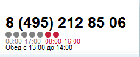
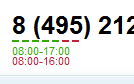
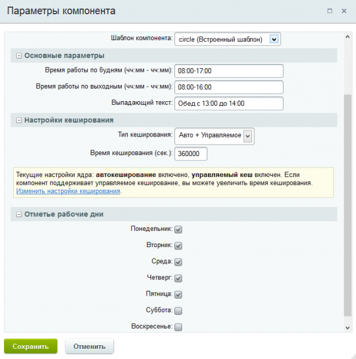

# Отображение режима работы и выходных на сайте

**Описание решения**  
Это маленький и простой бесплатный компонент для отображение режима работы компании в двух темах -- на выбор:
квадратиками
кругляшками 

Установка автоматическая
1. установить модуль
2. разместить на странице компонент yenisite:worktime  

