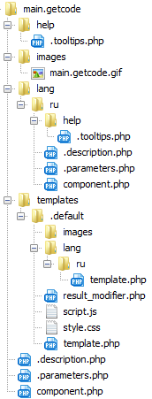
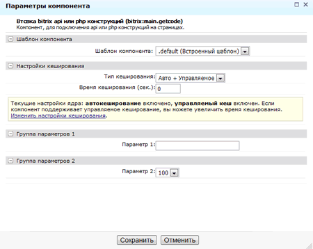

 Использование Bitrix API для решения частных задач порождает так называемый "код на странице", когда модификация происходит не в шаблоне компонента и не в самом компоненте(предварительно скопированном в своё пространство имён), на странице появляется php конструкция выполняющая определённые действия. Если данный код находиться во включаемой области или в шаблоне - кроме кеширования данного фрагмента проблем нет, но если данный код расположен на странице то возникнут проблемы:
 <ul>
 <li>открытие данной страницы визуальным редактором</li>
 <li>масштабирование контента</li>
 <li>отсутствие кеширования</li>
 </ul>  
 
   По этому удобно и безопасно упаковывать код в компонент. Манипуляция компонентом удобна и проста как для пользователя так и непосредственно для самого разработчика. Не всегда есть время писать компоненты, да и не всегда есть в этом потребность. Можно использовать некий шаблон, в нашем случае main.getcode для быстрой упаковки bitrix API и PHP структур в компонент. Что это нам даст:
   <ul>
   <li>возможность кешировать результат выполнения данных конструкций</li>
   <li>возможность предоставления некоего подобия до настройки результатов вывода контента для пользователя(если есть необходимость)</li>
   <li>использование шаблонов</li>
   </ul>
   
   Я предлагаю использовать следующую структуру компонента main.getcode


 Файл .parameters.php будет иметь следующий вид:
 ```php
<?
if (!defined("B_PROLOG_INCLUDED") || B_PROLOG_INCLUDED!==true) die();

if(!CModule::IncludeModule("iblock"))
	return;
	
$arComponentParameters = array(
   "GROUPS" => array(
	  "GROUP1" => array(
		 "NAME" => GetMessage("GROUP1_NAME")
	  ),
	  "GROUP2" => array(
		 "NAME" => GetMessage("GROUP2_NAME")
	  ),
   ),
   "PARAMETERS" => array(
	  "PARAM1" => array(
		 "PARENT" => "GROUP1",
		 "NAME" => GetMessage("PARAM1_NAME"),
		 "TYPE" => "STRING",
		 "DEFAULT" => '',
	  ),
	  "PARAM2" => array(
		 "PARENT" => "GROUP2",
		 "NAME" => GetMessage("PARAM2_NAME"),
		 "TYPE" => "LIST",
		 "VALUES" => array('1' => '10', '2' => '50', '3' => '100'),
		 "DEFAULT" => '1',
	  ),
	  
	  "CACHE_TIME" => array(),
   )
);
	
?>
```

В последствии данный файл можно сконфигурировать под свои нужды, добавить необходимые параметры и переменные которые через $arParams использовать в компоненте. Иногда дать клиенту(пользователю) пару настроек(количество на странице, выбор из многих ИБ и т.д.) в дальнейшем использовании приятно и полезно для вас и для него.



Разместить конструкцию(код) который был бы ранее размещён на странице можно в файле result_modifier.php. Остальные файлы шаблона template.php, script.js, style.css оставляем пустыми, в последствии если в result_modifier.php сформировать $arResult можно использовать полноценно функционал шаблонов. То есть если у вас на странице был размещён следующий код:

```php
<?if(CModule::IncludeModule("iblock"))
{

	if (!empty($m))
		$items = GetIBlockElementListEx("news", Array($sec), Array(38, 41, 42, 48), Array("ACTIVE_FROM"=>"DESC","SORT"=>"ASC", "NAME"=>"DESC"), 0, 
		Array(
				"ACTIVE_FROM"=>date($DB->DateFormatToPHP(CLang::GetDateFormat("SHORT")), mktime(0,0,0,$m,1,$y)),
				"!ACTIVE_FROM"=>date($DB->DateFormatToPHP(CLang::GetDateFormat("SHORT")), mktime(0,0,0,$m+1,1,$y))
		));
	else
		$items = GetIBlockElementListEx("news", Array($sec), Array(38, 41, 42, 48), Array("ACTIVE_FROM"=>"DESC","SORT"=>"ASC", "NAME"=>"DESC"), 0, $GLOBALS['arrCad']);
		$items->NavStart(20, false, false);
		$items->NavPrint("Cтраницы:");
?>
	<br />
		<br />
<?
		while($arItem = $items->GetNext()):
		$arIBlockElement = GetIBlockElement($arItem["ID"]);
		$arProps = $arIBlockElement["PROPERTIES"];
		$arLinkProp = $arProps["LINK"];?>
					<div class="news">
					<?if ($arItem["DETAIL_TEXT"] && !$arLinkProp["VALUE"]):?><h4><a href="<?echo $arItem["DETAIL_PAGE_URL"]?>"><?elseif ($arLinkProp["VALUE"]):?><a href="<?echo $arLinkProp["VALUE"]?>"><?else:?><br /><?endif;?><?echo $arItem["NAME"]?><?if ($arItem["DETAIL_TEXT"] || $arLinkProp["VALUE"]):?></a></h4><?endif;?>
					
					<small><?echo $arItem["ACTIVE_FROM"]?><strong>
					<?echo $arIBlockElement["PROPERTIES"]["podpis"]["VALUE"]?></strong></small>
	<p><?echo ($arItem["PREVIEW_TEXT"])?$arItem["PREVIEW_TEXT"]:"" ?></p>
		</div>
		<?endwhile;?>
	<?
	$items->NavPrint("Cтраницы:");
	?>

<?
} else {
	echo GetMessage("MODULE_NOT_INSTALLED");
}
?>
```

его необходимо скопировать в файл result_modifier.php компонента  main.getcode. Таким образом мы получим на странице вместо выше приведенных конструкций вызов компонента в котором и будет выполняться ваш код:

```php
<?$APPLICATION->IncludeComponent(
	"bitrix:main.getcode",
	"",
	Array(
		"PARAM1" => "",
		"PARAM2" => "1",
		"CACHE_TYPE" => "A",
		"CACHE_TIME" => "0"
	)
);?>
```
 Думаю суть и удобство данного подхода вы поняли. Так же на основе данного компонента можно создавать свои компоненты.