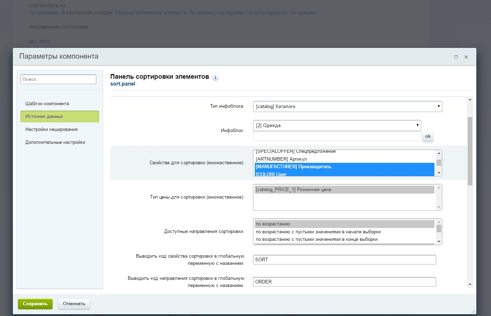
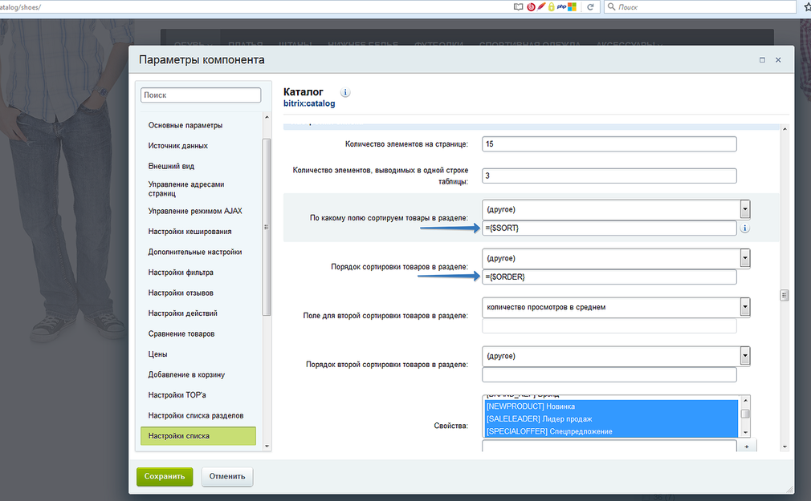

Bitrix Sort Panel
==============

Компонент выводит панель сортировки для компонентов, выводящих списки элементов, например: news.list, catalog.section итд

* Сортировка по названию, новизне, популярности
* Сортировка по цене
* Сортировка по свойствам инфоблока
* Выбор направления сортировки (6 видов)
* Возможность сохранять выбранный тип и направление сортировки в сессии пользователя

Установка
---------

1. Скопируйте папку `sort.panel` в `/local/components/` вашего сайта
2. Установить компонент на страницу 
3. В настройках компонента выбрать параметры, по которым будет показана сортировка 

4. В настройках компонента списка элементов('catalog.section', 'news.list' итд) задать 
соответствующее название переменной, содержащей значение сортировки и направления сортировки (по умолчанию:SORT и ORDER).
Например:
- скриншот ввода значения в настройки компонента: 

- скриншот исходного кода: https://yadi.sk/i/0n36bABw35cipn