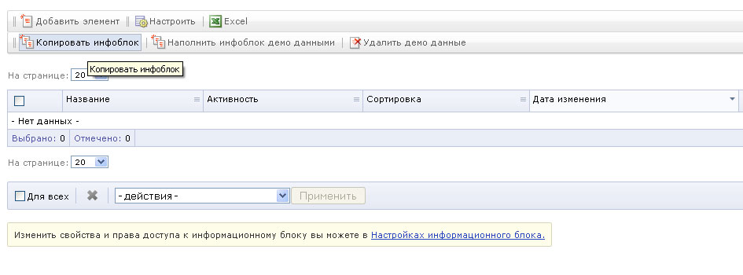
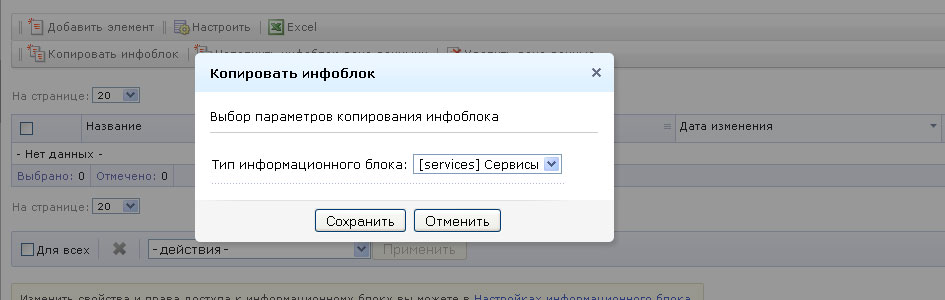
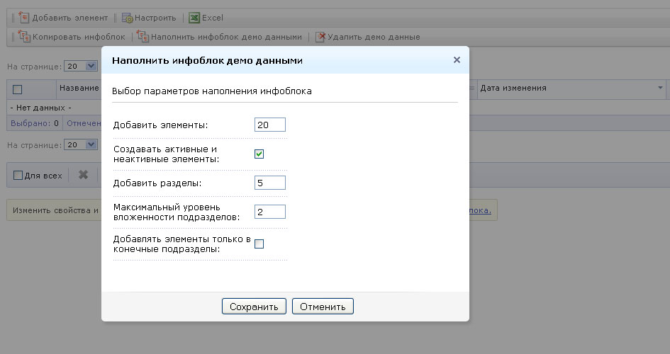
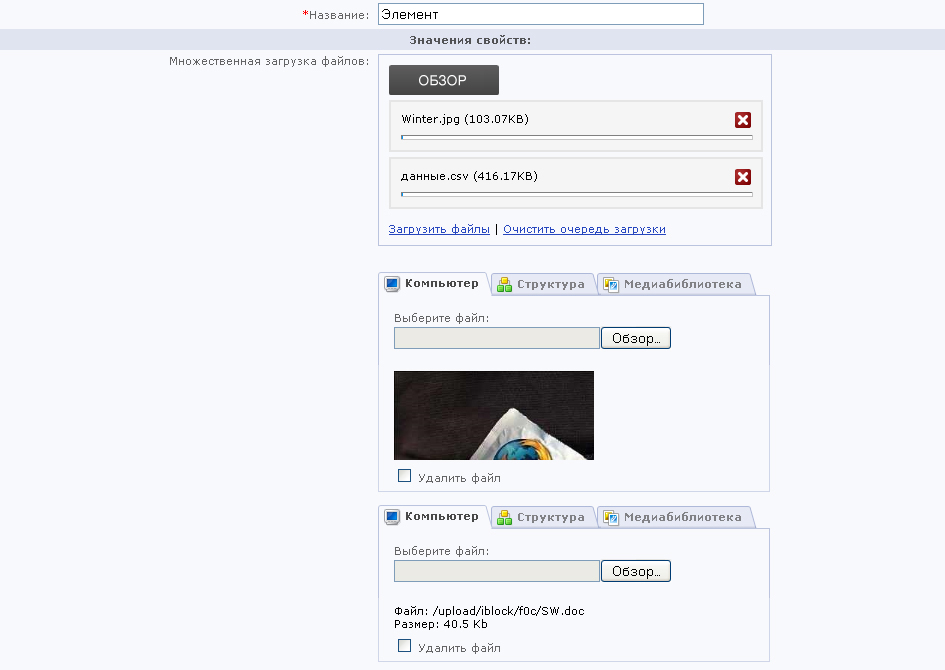
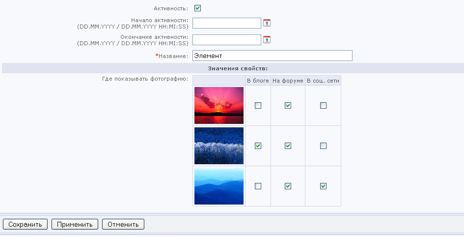
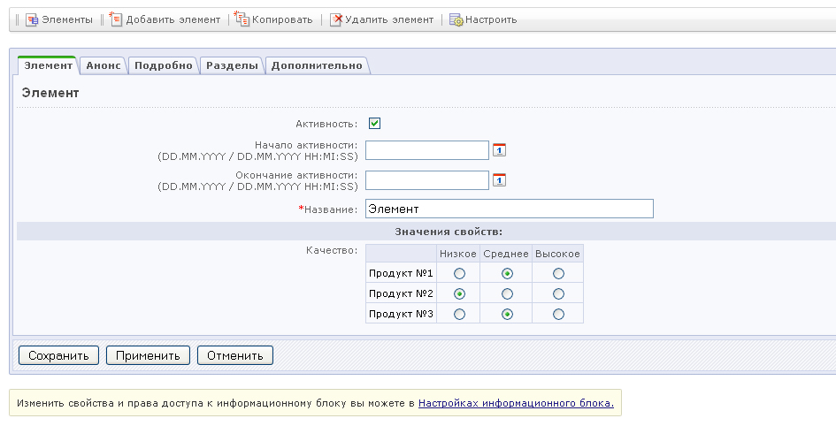
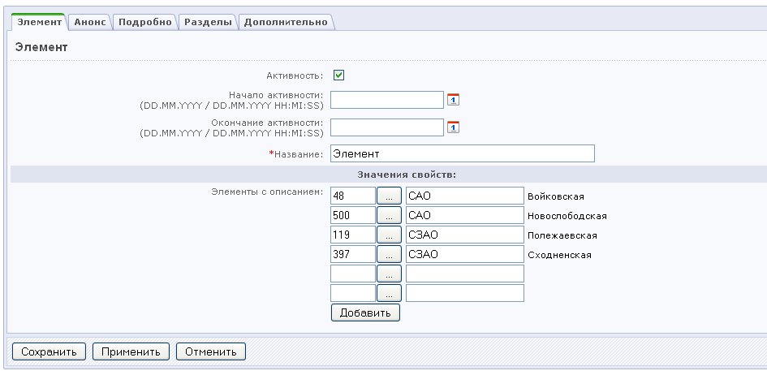
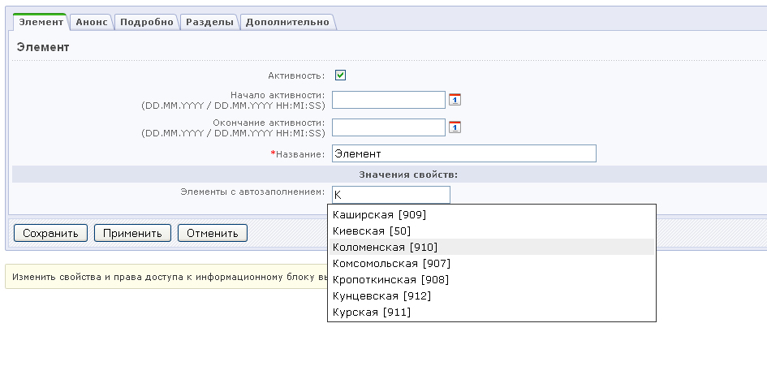
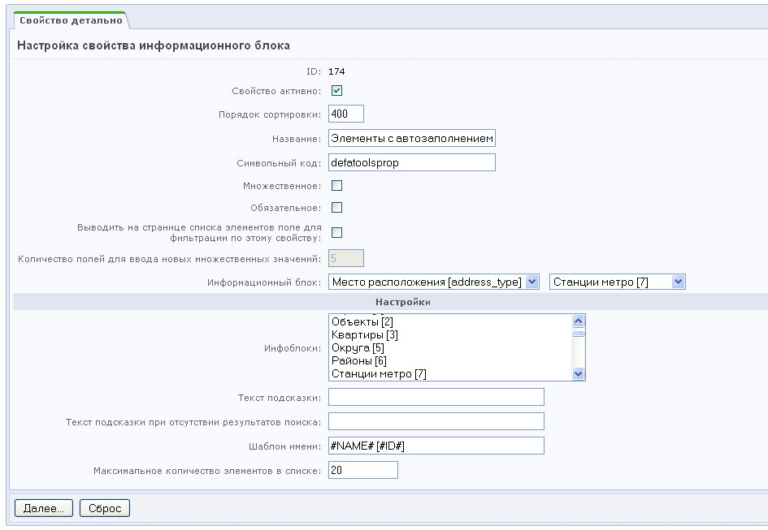
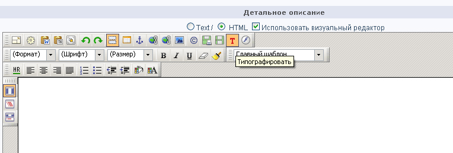

# DEFA Tools

Описание 

DEFA Tools – обновляемый программный модуль, содержащий разнообразные решения для 1C-Битрикс. 

Модуль содержит новые свойства инфоблоков, пользовательские свойства, типограф для визуального редактора.

1. Копирование инфоблока
ЗАЧЕМ ЗАЧЕМ Позволяет скопировать инфоблок, сохранив все его параметры и набор свойств элементов. 
КАК КАК У администратора сайта на странице просмотра списка элементов инфоблока в верхней панели появляется дополнительная кнопка. При клике открывается диалог выбора типа инфоблока, к которому будет привязан созданный инфоблок. Удобно использовать при дублировании инфоблоков для многоязычных сайтов. 

	

2. Автоматическое наполнение инфоблока демо данными
ЗАЧЕМ ЗАЧЕМ Позволяет буквально в два клика наполнить инфоблок тестовыми данными. 
КАК КАК У администратора сайта на странице просмотра списка элементов инфоблока в верхней панели появляется дополнительные кнопки «Наполнить инфоблок демо данными» и «Удалить демо данные». Можно указать количество создаваемых элементов и разделов, максимальный уровень вложенности разделов, управлять их активностью и т.п. Поддерживаются признаки обязательности и множественности для всех типов свойств и параметров элементов. Кнопка «Удалить демо данные» удаляет все элементы и разделы, созданные при помощи модуля DEFA Tools. 

3. Множественная загрузка файлов
ЗАЧЕМ ЗАЧЕМ Свойство создано для того, чтобы сделать максимально простым и быстрым процесс загрузки большого количества файлов, привязанных к элементам. Например – часто обновляемые сайты с большим количеством разнородной информации будет легче поддерживать с модулем DEFA Tools. 
Наполнять элементы легче – просто выбирайте через плагин нужные файлы и одним кликом загружайте их все сразу. 
КАК КАК Загрузка может осуществляться двумя способами: 
– Java applet (стандартный, встроенный в 1C-Битрикс) 
– Adobe Flash (плагин Uploadify, использующий библиотеку jQuery) 

	
	
4. Таблица вопросов «optionsgrid»
ЗАЧЕМ ЗАЧЕМ позволяет создавать универсальные таблицы «опросники», в которых строки таблиц соответствуют вопросам – столбцы в свою очередь соответствуют ответам. При этом ответы могут быть множественными или одиночными. Причем: если в поле вопроса указать адрес картинки на сервере – картинка будет отображаться в таблице. 
КАК КАК	Достаточно создать только один элемент инфоблока, в котором есть свойство «optionsgrid», а в его настройках задать всю структуру таблицы. 

	
5. Элемент с описанием
ЗАЧЕМ ЗАЧЕМ	Позволяет задать описание каждому привязываемому элементу. Например – у Вас интернет-магазин, у каждого товара есть связанные товары, которые с этим товаром покупают. Теперь можно легко ввести текстовый комментарий для этой связи. Является доработанным свойством «Привязка к элементам». 
КАК КАК Просто введите текст в поле описания. 

6. Привязка к элементам с автозаполнением
ЗАЧЕМ ЗАЧЕМ Позволяет больше не ждать открытия«нового окна» и искать в нем нужный элемент. Также позволяет выводить текстовое поле, при заполнении которого осуществляется поиск по названиям элементов выбранных инфоблоков. При этом отображается всплывающая подсказка с найденными элементами. Данный модуль является переработанным свойством «Привязка к элементам».
КАК КАК Достаточно просто набрать начальные буквы названия элемента, и появится полный список тех элементов, которые начинаются с этих букв. Введите букву – выберите элемент – нажмите Ввод.

7. Типограф для визуального редактора
ЗАЧЕМ ЗАЧЕМ Типограф – средство подготовки русского текста к публикации на страницах сайта. Встраивается в визуальный редактор Битрикса в виде кнопки. 
Используется онлайн сервис www.typograf.ru 
КАК КАК Ввести текст в поле визуального редактора. Нажать кнопку «Типорафировать» на панели инструментов. Обработанный типографом текст заменит исходный. 
HTML форматирование сохраняется. 
	
8. Привязка к директории (на сервере)
ЗАЧЕМ ЗАЧЕМ Свойство инфоблока, позволяющее привязывать элемент к существующему разделу структуры сайта. В отличие от стандартного «Привязка к файлу на сервере» нужно выбрать директорию, а не файл. 
КАК КАК При нажатии на кнопку «Обзор» появляется стандартное окно, в котором показаны только папки. После выбора необходимо нажать кнопку «Открыть». 
