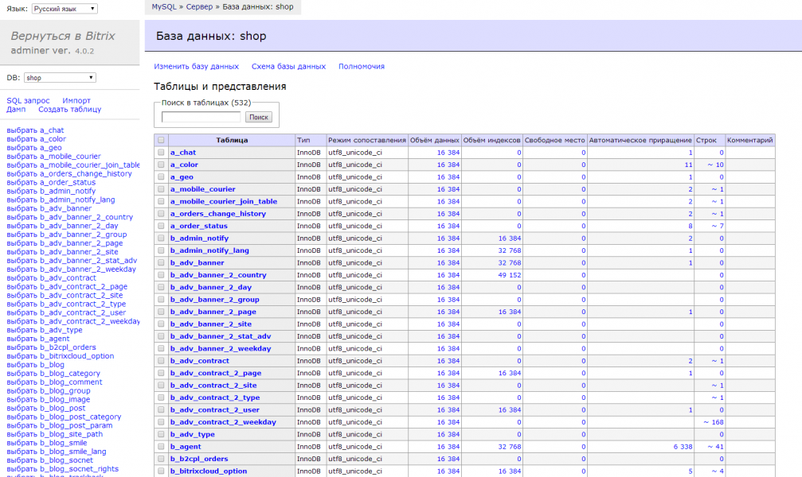

# SQL Adminer
 

https://marketplace.1c-bitrix.ru/solutions/uniplug.sqladminer/ 

**Описание**

Только для опытных разработчиков!

Решение "Работа с SQL" позволяет работать напрямую с MySQL базой данных.

Решение незаменимо при разработке и отладке на удаленном сервере.

Не требует отдельного ввода пароля к базе (автоматически используются реквизиты из настроек 1C-Bitrix)
Не использует phpMyAdmin
Основано на [adminer.org](http://www.adminer.org/)
Код модуля открыт и опубликован на GitHub, ждем ваших push-request

Разработчик - IT-Группа ЮниПлаг

модуль "Поиск троянов" выдает ложное срабатывание по статье "binary data".
В отсутствии вирусов мы можете убедится сами, собрав модуль из исходных кодов с [GitHub](https://github.com/uniplug/bitrix.uniplug.sqladminer)

**Установка**

- Нажмите кнопку "Установить" в карточке решения
- Укажите адрес вашего сайта
- После установки в административной части в разделе "Сервисы" появится пункт "Работа c SQL"