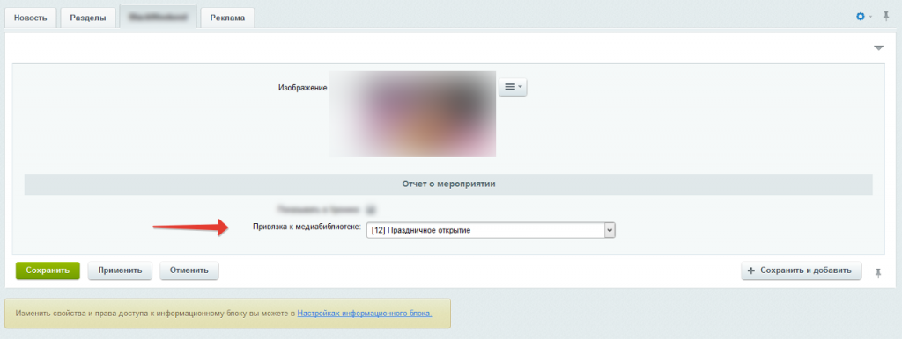

# Свойство инфоблока Привязка к медиабиблиотеке

**Описание решения**

Модуль добавляет новое пользовательское свойство "Привязка к медиабиблиотеке", таким образом расширяя набор стандартных пользовательских свойств.

Позволяет выводить список активных коллекций медиабиблиотеки и сохранять ID, привязывая к элементу инфоблока.

**Установка**
Установка стандартная.
После установки данного модуля, в настройках инфоблоков автоматически появится  новый тип свойств: "Привязка к медиабиблиотеке" 

