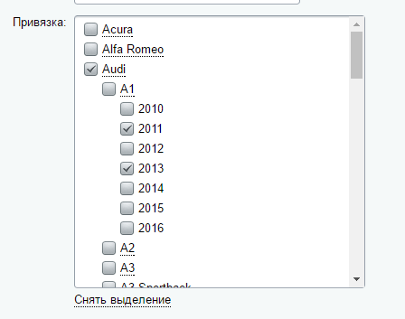
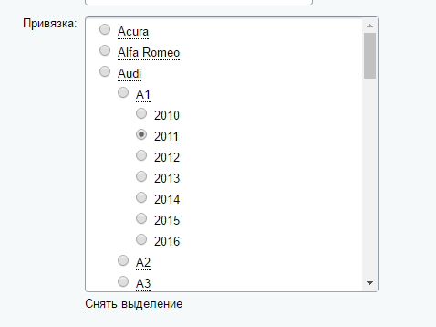
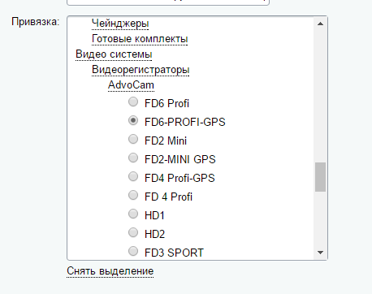
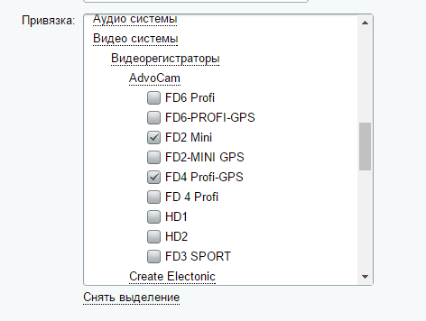

# Удобная привязка к разделам/элементам инфоблока
https://marketplace.1c-bitrix.ru/solutions/aat.iblockprops/ 

Описание 

После установки вы сможете пользоваться пользовательскими типами свойств «Привязка к разделам (checkbox/radio)» и «Привязка к элементам (checkbox/radio)»

