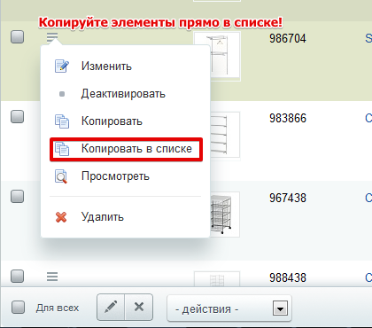
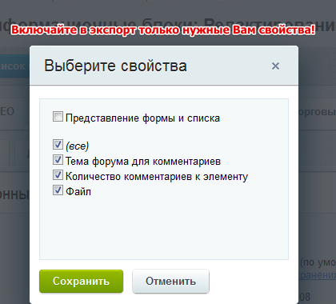
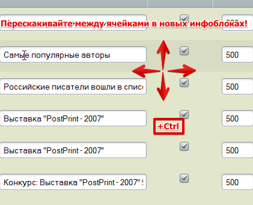
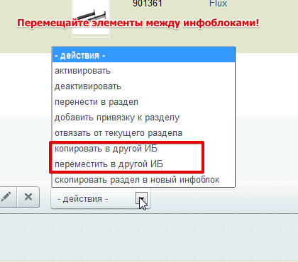
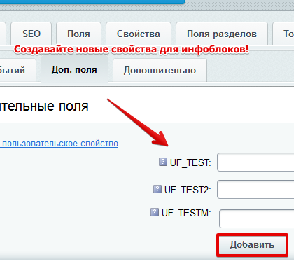
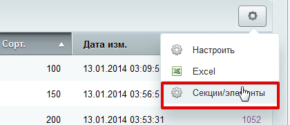
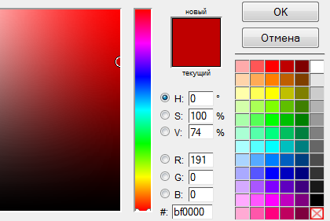
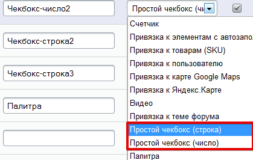

# Инфоблоки, инструменты

**Описание решения**

Модуль расширяет стандартный функционал инфоблоков.

    Возможность копирования и перемещенияэлементов между инфоблоками
    Удобное перемещение между ячейками в новых инфоблоках
    Возможности копирования различных элементов в рамках одного инфоблока
    Опция «отвязать от текущего раздела».
    Типы свойств «Простой чекбокс» и «Палитра»
    Кнопка просмотра элемента в публичной части.
    Экспорт и импорт свойств инфоблока. А также формы элемента и секции.
    Пользовательские свойства инфоблоков
    Удобное управление чекбоксами списков.
    Переключатель режима просмотра элементов в одном инфоблоке 

