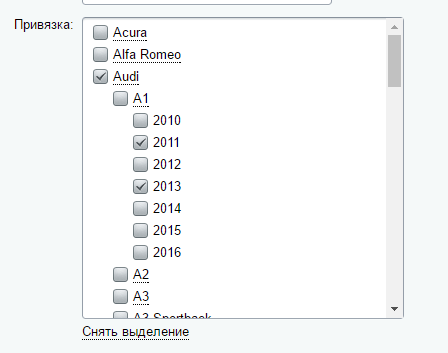
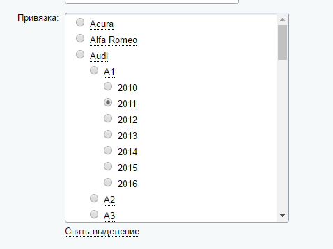
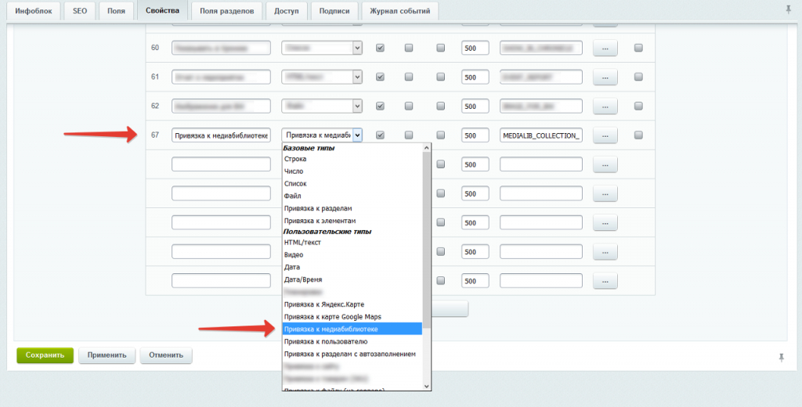
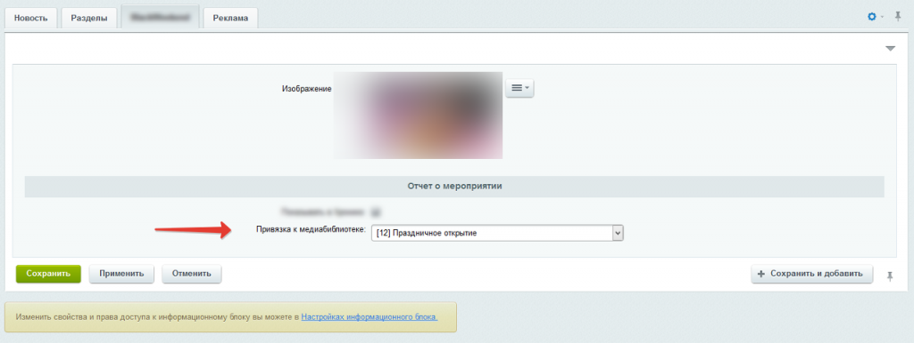
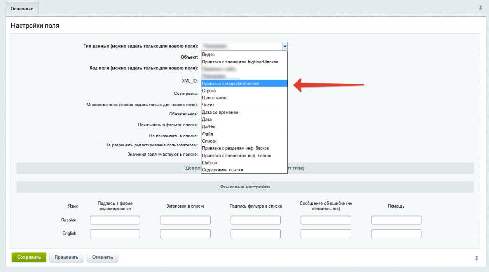

# Классы CAATIBlockPropSection, CAATIBlockPropElement
## Удобная привязка к разделам/элементам инфоблока
https://marketplace.1c-bitrix.ru/solutions/aat.iblockprops/ 

Описание 

После установки вы сможете пользоваться пользовательскими типами свойств «Привязка к разделам (checkbox/radio)» и «Привязка к элементам (checkbox/radio)»





---

# Класс PropMediaLibIblockProperty
# Свойство инфоблока Привязка к медиабиблиотеке


https://marketplace.1c-bitrix.ru/solutions/fgsoft.propmedia/

**Описание решения**

Модуль добавляет новое пользовательское свойство "Привязка к медиабиблиотеке", таким образом расширяя набор стандартных пользовательских свойств.

Позволяет выводить список активных коллекций медиабиблиотеки и сохранять ID, привязывая к элементу инфоблока.

**Установка**
Установка стандартная.
После установки данного модуля, в настройках инфоблоков автоматически появится  новый тип свойств: "Привязка к медиабиблиотеке" 







---

# Класс GetSection
Получаем разделы и вложенные подразделы в иерархическом виде

Использование: 

```php
 GetSection::getSectionList(Array('IBLOCK_ID' => 'ID инфоблока'), Array('NAME','SECTION_PAGE_URL'));
```

---

# Класс HelperFunctionGetSection
Задаем формат показа размера файла

---

