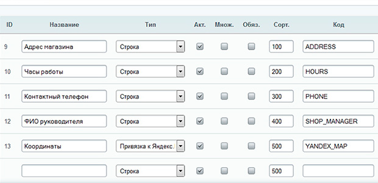
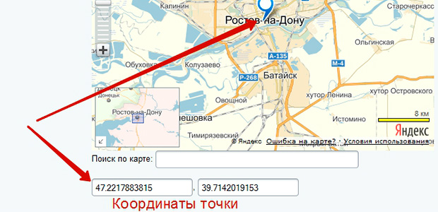

# Яндекс-карты

Описание 

Компонент выводит яндекс-карту из инфоблока.

##Установка

Подготовка информационного блока. 
Допустим у нас есть несколько магазинов которые мы хотим показывать на интерактивной яндекс карте + давать пользователям какую-нибудь доп. информацию о них, например точный адрес магазина, часы работы, контактный телефон и ФИО руководителя. Т.е. по клику на точку на яндекс карте, мы увидим некий блок, так называемый балун с доп. информацией о магазине. Для формирования самой точки на карте, нам потребуется задавать её координаты, для этого в 1С Битрикс существует тип поля привязка к Яндекс карте.

Приступим! Создаём инфоблок Магазины со следующими свойствами (Имя свойства — тип — мнемонический код):

* Адрес магазина — тип строка — ADDRESS
* Часы работы — тип строка — HOURS
* Контактный телефон — тип строка — PHONE
* ФИО руководителя — тип строка — SHOP_MANAGER
* Координаты — тип привязка к яндекс карте — YANDEX_MAP

Сохраняем инфоблок и добавляем в него несколько элементов, я добавил 3 магазина с 3-мя адресами в разных районах города Ростов-на-Дону. Важно при добавлении магазинов указать адрес на интерактивной карте Яндекс и сделать двойной щелчёк по заданной точке, чтобы заполнились поля координат точки иначе не получится построить точку на карте.

Добавляем несколько элементов.

___
map.png - иконка маркера на карте
map-a.png - активная иконка маркера на карте, т.е. при наведении курсора мышки
map-claster.png - иконка кластера (т.е. группы точек) на крате
start.js - JavaScript код
style.css - css - стили контейнера карты и иконок
template.php - шаблон компонента bitrix:news.list с помощью которого объекты выведены в публичную часть сайта

